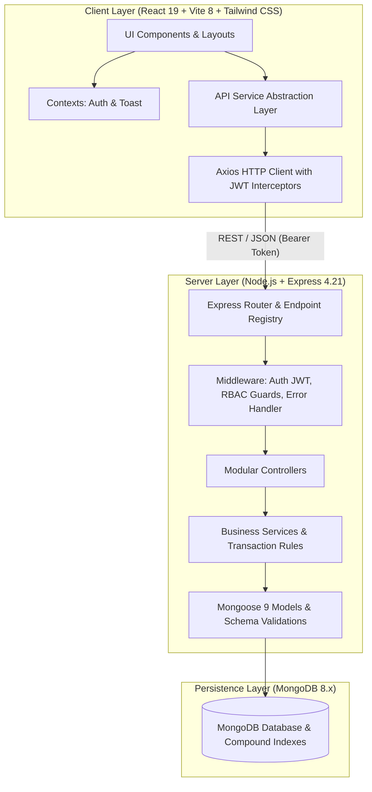

# KODBRAND Enterprise Real Estate CRM — Architecture Guide

## 1. System Overview

The **KODBRAND Enterprise Real Estate CRM & ERP** is built on a modern MERN stack (MongoDB, Express, React, Node.js) structured as an enterprise-grade monorepo. The application provides an end-to-end sales, operational, inventory, and financial workflow tailored for high-volume real estate developers, agencies, and brokerage networks.



---

## 2. Directory Structure

```text
real-estate-crm/
├── client/                      # Frontend Application (React 19, Vite, Tailwind CSS)
│   ├── public/                  # Static assets & favicon
│   ├── src/
│   │   ├── app/                 # Application entry, router, providers
│   │   ├── components/
│   │   │   ├── common/          # Atomic UI: Button, Badge, Card, Modal, DataTable, EmptyState
│   │   │   └── layout/          # DashboardLayout, Sidebar, Header
│   │   ├── context/             # AuthContext (sessions, tokens), ToastContext (alerts)
│   │   ├── pages/               # 15 Module Views (Dashboard, Leads, Telecallers, Bookings, etc.)
│   │   ├── services/            # API abstraction (apiClient, authService, leadService, etc.)
│   │   ├── styles/              # Global Tailwind CSS and KODBRAND corporate palette
│   │   ├── constants/           # Navigation items and roles definitions
│   │   ├── index.html           # HTML template
│   │   ├── main.jsx             # React DOM root
│   │   └── vite.config.js       # Vite proxy config (/api, /uploads -> port 5000)
│   ├── package.json
│   └── .env.example
│
├── server/                      # Backend Application (Node.js, Express, Mongoose)
│   ├── src/
│   │   ├── config/              # Environment config and MongoDB Mongoose connector
│   │   ├── middleware/          # JWT auth, RBAC authorization, error handler, Multer uploads
│   │   ├── models/              # 18 Mongoose models with strict indexes and validation
│   │   ├── modules/             # 15 Domain modules (routes, controllers, services)
│   │   │   ├── auth/            # Authentication, profile, user seed
│   │   │   ├── dashboard/       # Aggregations, pipeline counts, telecaller metrics
│   │   │   ├── leads/           # Lead ingest, assignment, stages, history, import/export
│   │   │   ├── telecallers/     # Call logging, auto-followups, daily queue
│   │   │   ├── meetings/        # In-person and virtual buyer appointments
│   │   │   ├── site-visits/     # Property tours, pickup logistics, feedback
│   │   │   ├── projects/        # Master development complexes, total & available units
│   │   │   ├── properties/      # Units inventory, pricing, compound uniqueness, status
│   │   │   ├── customers/       # Customer 360° aggregate views
│   │   │   ├── opportunities/   # Sales pipeline stages and Kanban deal values
│   │   │   ├── bookings/        # Atomic reservations, double-booking locks, discounts
│   │   │   ├── payments/        # Payments, DB balance recomputations, official receipts
│   │   │   ├── employees/       # User administration, role assignment, work queues
│   │   │   ├── commissions/     # Agent commission approval and disbursement
│   │   │   ├── accounts/        # General ledger transactions, balance reconciliation
│   │   │   ├── reports/         # Source, temperature, revenue, and agent analytics
│   │   │   ├── notifications/   # System-wide alert engine
│   │   │   └── settings/        # System configuration and audit trail logs
│   │   ├── utils/               # Structured response handlers, system logger
│   │   ├── app.js               # Express app configuration & middleware mounts
│   │   └── server.js            # HTTP server bootstrap & super admin seed
│   ├── tests/                   # 25 automated unit, integration, and workflow tests
│   ├── uploads/                 # Local directory for uploaded files and receipts
│   ├── package.json
│   └── .env.example
│
├── docs/                        # Complete System Documentation
│   ├── architecture.md          # Architecture & data flow specifications
│   ├── api-documentation.md     # REST endpoint catalog & request/response contracts
│   ├── database-schema.md       # 18 Mongoose entities, relationships, indexes
│   ├── permissions.md           # RBAC permissions matrix
│   ├── setup.md                 # Setup, local development, seeding, and build guide
│   └── testing-report.md        # Automated test suite coverage and results
│
├── .gitignore
├── package.json                 # Monorepo root scripts
└── README.md                    # Project README and quickstart
```

---

## 3. Architectural Design Patterns

### 3.1 Three-Tier Backend Layering
To guarantee high maintainability and testability, the backend avoids placing database logic or business rules inside HTTP controllers:
1. **Routes Layer (`routes.js`)**: Defines URI paths, HTTP verbs, authentication, and role authorization middlewares.
2. **Controllers Layer (`*Controller.js`)**: Orchestrates HTTP request inputs, parameters, and status codes via `sendSuccess` and `sendError`.
3. **Services Layer (`*Service.js`)**: Contains pure business rules, database transactions, concurrency checks, and mathematical balance calculations.
4. **Data Models Layer (`models/*.js`)**: Encapsulates schema definitions, types, default values, validations, and compound MongoDB indexes.

### 3.2 Frontend Architecture
- **Stateless Component Hierarchy**: Reusable atomic UI components (`DataTable`, `Modal`, `Badge`, `Card`, `Button`, `EmptyState`) live in `components/common/` with zero business logic coupling.
- **Service Layer Abstraction**: Components do not call `axios.get()` directly. Instead, they interact with strongly-typed service functions (`leadService.getLeads()`, `bookingService.createBooking()`) in `client/src/services/`.
- **JWT Interceptor Pattern**: `client/src/services/api/apiClient.js` automatically attaches the active Bearer token from localStorage to every outgoing request and handles global 401 unauthenticated redirects.
- **Role-Based Dynamic Navigation**: Navigation menus and route protections evaluate the user's role against permissible RBAC scopes before rendering navigation items or admitting access.

---

## 4. Key Business Safeguards & Concurrency Controls

### 4.1 Double-Booking Prevention & Atomic Unit Locking
- In real estate workflows, two agents must never be allowed to reserve the same apartment or commercial unit simultaneously.
- The `bookingService` utilizes atomic MongoDB queries:
  ```javascript
  const property = await Property.findOneAndUpdate(
    { _id: propertyId, status: 'Available' },
    { status: 'Reserved' },
    { new: true }
  );
  if (!property) {
    throw new Error('Property unit is no longer available for booking.');
  }
  ```
- If another concurrent request altered the unit status from `Available` milliseconds earlier, `findOneAndUpdate` returns `null` atomically, rejecting the second transaction safely without race conditions.

### 4.2 Financial Integrity & Ledger Synchronization
- **Server-Side Balance Recalculation**: The frontend is never trusted with balance computations. Upon recording a payment, the backend queries all confirmed payments for that booking, recomputes `totalPaidAmount`, verifies that it does not exceed `finalSalePrice`, and updates `balanceDue` and `status` (`Partially Paid` or `Fully Paid`).
- **Idempotency & Duplicate Reference Protection**: Payment transactions enforce a unique index on `transactionReference`. If a network glitch causes duplicate submission of the same cheque or transfer reference, it is rejected immediately.
- **Automatic General Ledger Posting**: Confirming a booking or processing an approved commission payout automatically generates a linked transaction in the `accounts` ledger (`Income` or `Expense`), ensuring books balance in real time.

### 4.3 Discount Approval Safeguards
- Any booking that includes a discount greater than 0 triggers validation against the requesting user's role.
- If the discount exceeds 5% of unit price and the user is not an `admin`, `super_admin`, or `sales_manager`, the discount is rejected.

---

## 5. Security Architecture

1. **Authentication**: Stateless JSON Web Tokens (JWT) signed with HMAC-SHA256, carrying user ID, email, and role claims.
2. **Password Security**: Passwords are encrypted using `bcryptjs` with 10 salt rounds and excluded from standard database queries via `{ select: false }`.
3. **RBAC Guard**: Express middleware `authorize(['super_admin', 'admin', ...])` evaluates token roles against endpoint permission lists before controllers execute.
4. **Audit Trail**: Sensitive actions (role changes, booking approvals, cancellations, payments) write structured audit entries into the `AuditLog` collection with actor ID, IP address, timestamp, and metadata diffs.
