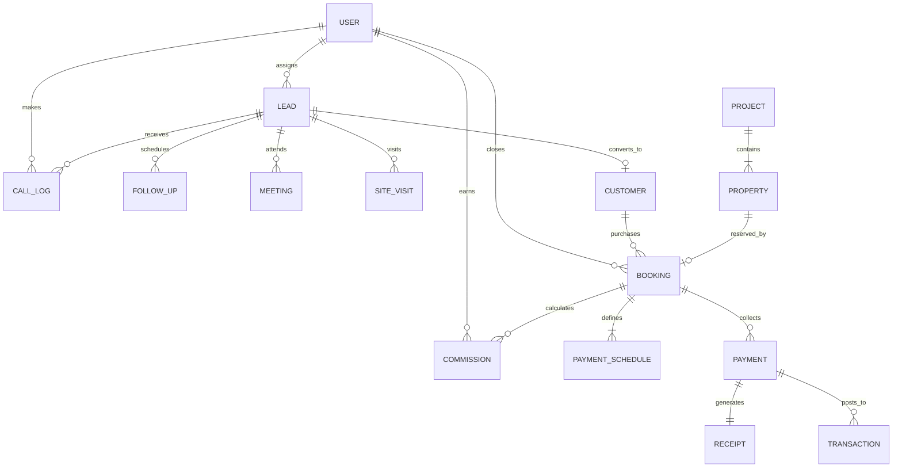

# KODBRAND Enterprise Real Estate CRM — Database Schema Guide

## 1. Entity-Relationship Overview

---

## 2. Model Definitions & Indexes

### 2.1 User (`User.js`)
Stores employee accounts, login credentials, and role assignments.
- **Fields**:
  - `name`: `String` (required, trim)
  - `email`: `String` (required, unique, lowercase, trim)
  - `password`: `String` (required, select: false)
  - `role`: `String` (enum: `super_admin`, `admin`, `sales_manager`, `sales_executive`, `telecaller`, `accountant`, `guest`; default: `telecaller`)
  - `department`: `String` (default: `Sales`)
  - `phone`: `String`
  - `isActive`: `Boolean` (default: `true`)
  - `lastLogin`: `Date`
- **Indexes**:
  - `{ email: 1 }` (unique)
  - `{ role: 1 }`
  - `{ isActive: 1 }`

---

### 2.2 Lead (`Lead.js`)
Stores inbound and prospect inquiries across all marketing channels.
- **Fields**:
  - `leadNumber`: `String` (unique, generated e.g. `LD-100234`)
  - `name`: `String` (required, trim)
  - `phone`: `String` (required, trim)
  - `email`: `String` (trim, lowercase)
  - `source`: `String` (enum: `Website`, `MagicBricks`, `99Acres`, `Facebook Ads`, `Google Ads`, `Walk-in`, `Referral`, `Other`)
  - `status`: `String` (enum: `New`, `Contacted`, `Qualified`, `Visit Scheduled`, `Negotiation`, `Won`, `Lost`)
  - `temperature`: `String` (enum: `Hot`, `Warm`, `Cold`, `RNT`, `SwitchedOff`, `Call Back`)
  - `budget`: `Number`
  - `preferredPropertyType`: `String` (enum: `1 BHK`, `2 BHK`, `3 BHK`, `4 BHK`, `Villa`, `Plot`, `Commercial`)
  - `preferredProject`: `ObjectId` -> `Project`
  - `assignedTo`: `ObjectId` -> `User`
  - `telecaller`: `ObjectId` -> `User`
  - `notes`: `String`
  - `tags`: `[String]`
- **Indexes**:
  - `{ phone: 1 }`
  - `{ status: 1 }`
  - `{ temperature: 1 }`
  - `{ assignedTo: 1 }`
  - `{ createdAt: -1 }`

---

### 2.3 CallLog (`CallLog.js`)
Tracks phone communications, duration, and outcomes.
- **Fields**:
  - `lead`: `ObjectId` -> `Lead` (required)
  - `caller`: `ObjectId` -> `User` (required)
  - `callOutcome`: `String` (enum: `Connected`, `Busy`, `Switched Off`, `Ringing No Answer`, `Wrong Number`, `Follow-up Requested`)
  - `durationSeconds`: `Number` (default: 0)
  - `recordingUrl`: `String`
  - `notes`: `String`
  - `callTime`: `Date` (default: `Date.now`)
- **Indexes**:
  - `{ lead: 1, callTime: -1 }`
  - `{ caller: 1, callTime: -1 }`

---

### 2.4 FollowUp (`FollowUp.js`)
Manages scheduled agent reminders and callbacks.
- **Fields**:
  - `lead`: `ObjectId` -> `Lead` (required)
  - `assignedTo`: `ObjectId` -> `User` (required)
  - `scheduledAt`: `Date` (required)
  - `priority`: `String` (enum: `Low`, `Medium`, `High`, `Urgent`; default: `Medium`)
  - `status`: `String` (enum: `Pending`, `Completed`, `Overdue`, `Cancelled`; default: `Pending`)
  - `notes`: `String`
- **Indexes**:
  - `{ assignedTo: 1, scheduledAt: 1 }`
  - `{ status: 1 }`

---

### 2.5 Customer (`Customer.js`)
Customer 360° record with personal details and converted lead ties.
- **Fields**:
  - `customerNumber`: `String` (unique, generated e.g. `CUST-20045`)
  - `name`: `String` (required)
  - `phone`: `String` (required, unique)
  - `email`: `String`
  - `pan`: `String`
  - `aadhaar`: `String`
  - `address`: `String`
  - `leadSource`: `ObjectId` -> `Lead`
  - `totalBookings`: `Number` (default: 0)
  - `totalPaid`: `Number` (default: 0)
- **Indexes**:
  - `{ phone: 1 }` (unique)
  - `{ customerNumber: 1 }` (unique)

---

### 2.6 Project (`Project.js`)
Real estate development master plan (towers, phases, total units).
- **Fields**:
  - `name`: `String` (required, unique)
  - `location`: `String` (required)
  - `city`: `String` (required)
  - `projectType`: `String` (enum: `Residential`, `Commercial`, `Mixed-Use`, `Plots`)
  - `totalUnits`: `Number` (default: 0)
  - `availableUnits`: `Number` (default: 0)
  - `launchDate`: `Date`
  - `possessionDate`: `Date`
  - `amenities`: `[String]`
  - `status`: `String` (enum: `Upcoming`, `Under Construction`, `Ready to Move`, `Completed`)
- **Indexes**:
  - `{ name: 1 }` (unique)
  - `{ status: 1 }`

---

### 2.7 Property (`Property.js`)
Individual inventory units (Apartments, Penthouses, Offices, Villas).
- **Fields**:
  - `project`: `ObjectId` -> `Project` (required)
  - `tower`: `String` (required)
  - `unitNumber`: `String` (required)
  - `floor`: `Number`
  - `unitType`: `String` (enum: `1 BHK`, `2 BHK`, `3 BHK`, `4 BHK`, `Penthouse`, `Studio`, `Commercial Space`)
  - `superBuiltUpAreaSqFt`: `Number`
  - `carpetAreaSqFt`: `Number`
  - `basePrice`: `Number` (required)
  - `status`: `String` (enum: `Available`, `Reserved`, `Booked`, `Sold`, `Blocked`; default: `Available`)
- **Compound Index (Prevents Duplicate Units in Project Tower)**:
  - `{ project: 1, tower: 1, unitNumber: 1 }` (unique: true)
  - `{ status: 1 }`
  - `{ basePrice: 1 }`

---

### 2.8 Booking (`Booking.js`)
Unit sales reservation contracts with pricing breakdown and locks.
- **Fields**:
  - `bookingNumber`: `String` (unique, generated e.g. `BK-89412`)
  - `property`: `ObjectId` -> `Property` (required)
  - `customer`: `ObjectId` -> `Customer` (required)
  - `salesAgent`: `ObjectId` -> `User` (required)
  - `basePrice`: `Number` (required)
  - `discountAmount`: `Number` (default: 0)
  - `finalSalePrice`: `Number` (required)
  - `bookingAmount`: `Number` (required)
  - `totalPaidAmount`: `Number` (default: 0)
  - `balanceDue`: `Number` (required)
  - `status`: `String` (enum: `Draft`, `Reserved`, `Confirmed`, `Cancelled`; default: `Reserved`)
  - `reservationExpiresAt`: `Date`
  - `cancellationReason`: `String`
- **Indexes**:
  - `{ bookingNumber: 1 }` (unique)
  - `{ property: 1 }`
  - `{ customer: 1 }`
  - `{ salesAgent: 1 }`
  - `{ status: 1 }`

---

### 2.9 Payment (`Payment.js`) & Receipt (`Receipt.js`)
Financial collection vouchers, ledger linkage, and duplicate reference locking.
- **Payment Fields**:
  - `booking`: `ObjectId` -> `Booking` (required)
  - `amount`: `Number` (required)
  - `paymentMode`: `String` (enum: `Cheque`, `Bank Transfer`, `NEFT/RTGS`, `Card`, `Cash`, `UPI`)
  - `transactionReference`: `String` (unique, sparse)
  - `paymentDate`: `Date` (default: `Date.now`)
  - `status`: `String` (enum: `Pending`, `Confirmed`, `Failed`, `Refunded`; default: `Confirmed`)
  - `receivedBy`: `ObjectId` -> `User`
- **Receipt Fields**:
  - `receiptNumber`: `String` (unique, generated e.g. `REC-55102`)
  - `payment`: `ObjectId` -> `Payment` (required)
  - `booking`: `ObjectId` -> `Booking` (required)
  - `customer`: `ObjectId` -> `Customer` (required)
  - `amount`: `Number` (required)
- **Indexes**:
  - `{ transactionReference: 1 }` (unique, sparse)
  - `{ booking: 1 }`

---

### 2.10 Commission (`Commission.js`)
Agent deal earnings and disbursement tracking.
- **Fields**:
  - `booking`: `ObjectId` -> `Booking` (required)
  - `agent`: `ObjectId` -> `User` (required)
  - `commissionRatePercent`: `Number` (default: 2.0)
  - `commissionAmount`: `Number` (required)
  - `status`: `String` (enum: `Pending`, `Approved`, `Paid`, `Cancelled`; default: `Pending`)
  - `approvedBy`: `ObjectId` -> `User`
  - `paidAt`: `Date`
- **Indexes**:
  - `{ booking: 1 }`
  - `{ agent: 1 }`
  - `{ status: 1 }`

---

### 2.11 Transaction (`Transaction.js`)
General ledger entries powering accounting reconciliation.
- **Fields**:
  - `transactionType`: `String` (enum: `Income`, `Expense`)
  - `category`: `String` (enum: `Booking Payment`, `Commission Payout`, `Marketing Expense`, `Vendor Payment`, `Office Overhead`)
  - `amount`: `Number` (required)
  - `relatedBooking`: `ObjectId` -> `Booking`
  - `date`: `Date` (default: `Date.now`)
  - `notes`: `String`
- **Indexes**:
  - `{ date: -1 }`
  - `{ transactionType: 1 }`

---

### 2.12 AuditLog (`AuditLog.js`)
Tamper-resistant audit history for compliance and tracking.
- **Fields**:
  - `action`: `String` (required)
  - `entity`: `String` (required)
  - `entityId`: `String`
  - `actor`: `ObjectId` -> `User`
  - `ipAddress`: `String`
  - `changes`: `Object`
  - `createdAt`: `Date` (default: `Date.now`)
- **Indexes**:
  - `{ createdAt: -1 }`
  - `{ entity: 1 }`
  - `{ actor: 1 }`
